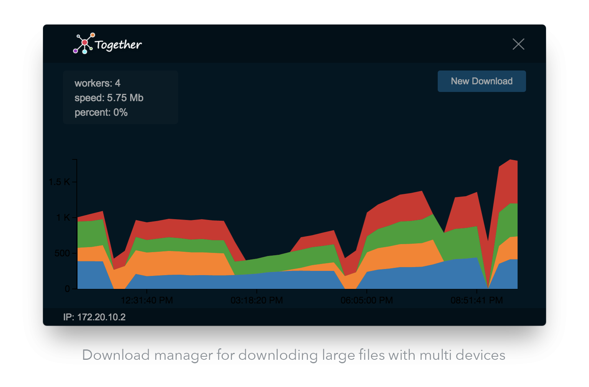

Together
======
# 	

Installing
------
Download the lastest  [Together](https://github.com/SadeghHayeri/Together/releases "Together Releases") release. (Linux - MacOs - Windows)


Developing
------
After cloning project run the following command in 'src' directory to get dependencies:
```bash
$ npm install
$ node_modules/electron/cli.js .
```


### To-Do List
- [x] Merge parts after download
- [ ] Security options
- [ ] Start/pause button
- [x] Auto detect nearby servers
- [x] Check/repair options
- [ ] List of worker (status-downloaded-uptime)